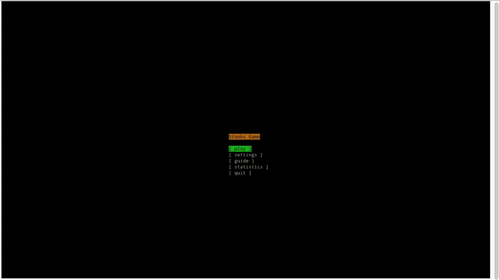

# Stonks-game

## Description

Stonks Game is an exchange trading simulator that runs directly in your terminal! You should buy items and sell them at a new price. If your balance drops below 0, you lose. You win if you earn enough money depending on the current difficulty.

Also, there are several bots - little AIs which will mess you.

Every 10 seconds, you'll have to pay tax, so be aware of it

In the `shared` folder, you can find game config, save, and other stuff. Feel free to edit these things as you wish, but remember, you have to remove save after every config change.

***

> This project was made for the "Educational practice on C++" course at Bauman Moscow State Technical University

## Table of contents

* [Installation](installation.md)
* [Gameplay](gameplay.md)
* [Configuration](config.md)
* [TUI library](tui.md)